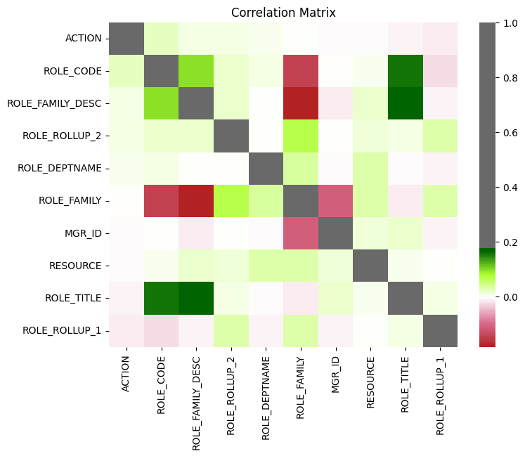
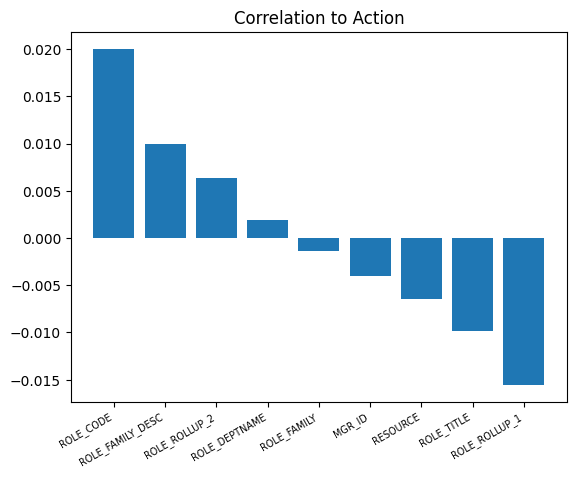
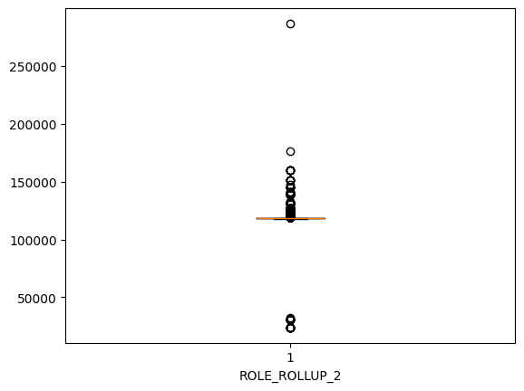
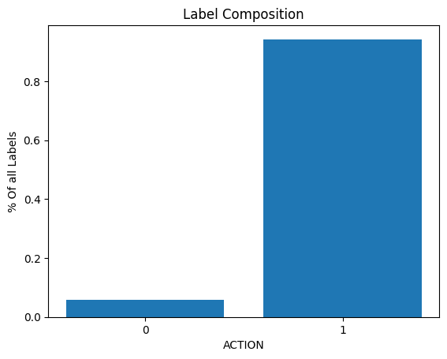
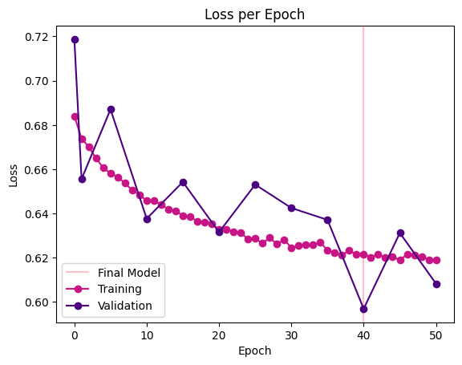
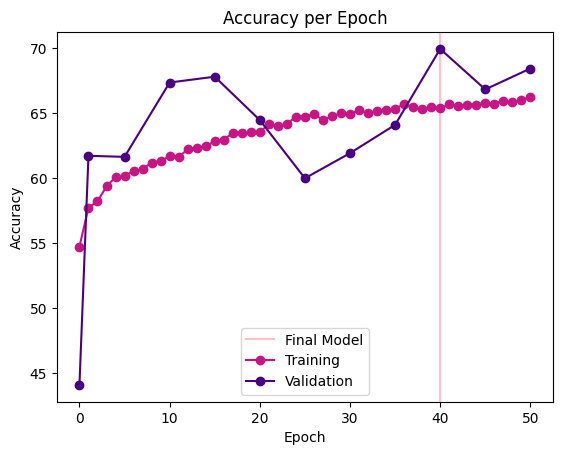
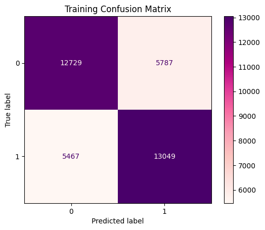
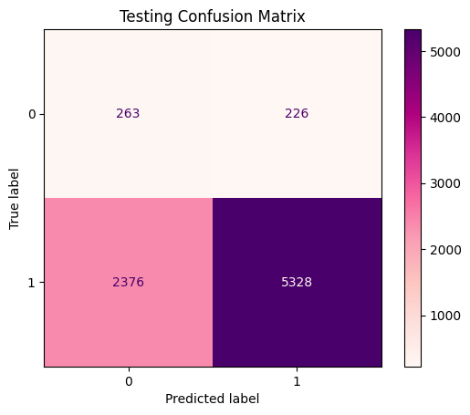
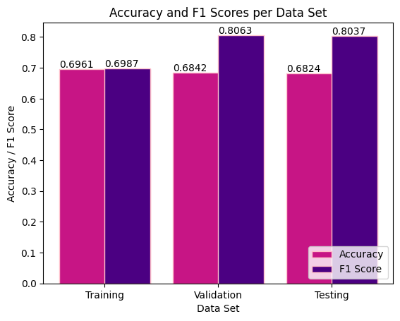

# Amazon Employee Access challenge
From Hofstra CSC270

The data provided is as follows:

| **Column Name**    |   **Description**
| ------------------ | --------------------------------------------------------------------------------------------------------------------- |
| ACTION             |   ACTION is 1 if the resource was approved, 0 if the resource was not                                                 |
| RESOURCE 	         |   An ID for each resource                                                                                             |
| MGR_ID 	         |   The EMPLOYEE ID of the manager of the current EMPLOYEE ID record; an employee may have only one manager at a time   |
| ROLE_ROLLUP_1 	 |   Company role grouping category id 1 (e.g. US Engineering)                                                           |
| ROLE_ROLLUP_2 	 |   Company role grouping category id 2 (e.g. US Retail)                                                                |
| ROLE_DEPTNAME 	 |   Company role department description (e.g. Retail)                                                                   |
| ROLE_TITLE 	     |   Company role business title description (e.g. Senior Engineering Retail Manager)                                    |
| ROLE_FAMILY_DESC   |   Company role family extended description (e.g. Retail Manager, Software Engineering)                                |
| ROLE_FAMILY 	     |   Company role family description (e.g. Retail Manager)                                                               |
| ROLE_CODE 	     |   Company role code; this code is unique to each role (e.g. Manager)     

When analyzing the data, I created a heatmap of the correlations between columns. Although the directions say use features with > 0.2 correlation to the target, and remove any features with > 0.8 correlation to another, there are no columns with correlations past either of these thresholds. I instead removed "ROLE_DEPTNAME" and "ROLE_FAMILY" which had the least correlations to "ACTION" at < 0.002

| **Column Name**     | **Correlation To Label** |
| ------------------- | ------------------------ |
| ROLE_CODE           | 0.020044                 |
| ROLE_FAMILY_DESC    | 0.009946                 |
| ROLE_ROLLUP_2       | 0.006315                 |
| ROLE_DEPTNAME       | 0.001889                 |
| ROLE_FAMILY         | -0.001394                |
| MGR_ID              | -0.004053                |
| RESOURCE            | -0.006446                |
| ROLE_TITLE          | -0.009851                |
| ROLE_ROLLUP_1       | -0.015538                |

Next, I created box and whisker plots for each feature to look for and remove potential outliers. This showed one outlier > 250,000 in ROLE_ROLLUP_2, so I dropped that row from the data.

The dataset is very unbalanced, which created issues in my first attempts. The models would only predict the majority class and never learn anything. I used Smote to balance the labels. It works by creating more data points of the minority class by comparing a few nearest neighbors. This helped greatly.

It was difficult to try out too many different architectures
or hyperparameters since the neural network takes a very long time to compute, especially when using (non-binary) entropy loss. I did originally attempt to use binary entropy loss by having `model.forward()` use `torch.argmax()` on `torch.softmax` before returning the prediction. However, this first resulted in the model only predicting 0's. After some adjustments, the model still performed extremely poorly, so I changed my approach to use a model more similar to the iris example.

As for amount of neurons, I originally ran a few epochs (15, 12) neurons. I then compared it to running some epochs increased neurons (10, 8). This resulted in a decrease in accuracy while training, so it was clear that neither of these options had enough neurons for the data. Finally, I scaled the neurons in relation to the 7 input features (35, 28). During training, the validation accuracy only reached about 68.42%. F1 score can be a better measure for unbalanced datasets. The model recieved an F1 score of 0.8063 during validation. During testing, it recieved respective accuracy and F1 scores of 68.24% and 0.8037, only slightly lower than the validation scores.
 

# Citations:
* **Smote**: https://medium.com/@corymaklin/synthetic-minority-over-sampling-technique-smote-7d419696b88c
* **Kaggle Page**: https://www.kaggle.com/c/amazon-employee-access-challenge/overview
* **Bar Chart Labels**: https://matplotlib.org/stable/api/_as_gen/matplotlib.pyplot.bar.html
